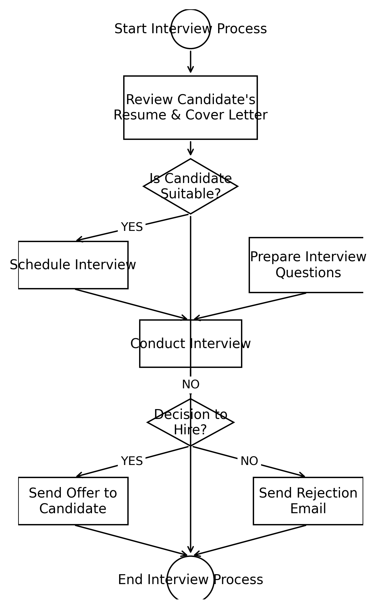
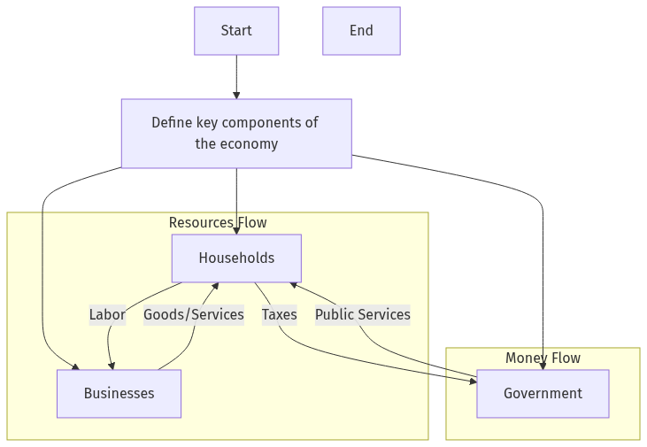

# Synthetic Data

An automated flowchart generation system that creates and validates Mermaid diagrams using Large Language Models (LLMs). The project generates synthetic flowcharts across multiple topics and difficulty levels, with built-in quality validation and multi-format output support.

## Results

The project generates flowcharts and converts them to different formats. Here are some example outputs:

### Matplotlib Generated Flowchart


### Mermaid Generated Flowchart  


## Package Manager

This project uses [uv](https://github.com/astral-sh/uv) as the Python package manager for faster dependency resolution and installation.

### Installation

First, install uv:
```bash
# On macOS and Linux
curl -LsSf https://astral.sh/uv/install.sh | sh

# On Windows
powershell -c "irm https://astral.sh/uv/install.ps1 | iex"

# Or with pip
pip install uv
```

If using Linux is probably that you have to add ```uv``` to your path, we can add the follow line to the shell config (like ```~/.bashr```).

```
export PATH="$HOME/.cargo/bin:$PATH"
```

Update your development workflow sections:

## Development

### Setup
```bash
# Clone the repository
git clone https://github.com/jorgemunozl/Synthetic-Data.git
cd Synthetic-Data
```

## Install dependencies

Use
```bash
uv sync
```

### Activate the virtual environment (if needed)

```bash
source .venv/bin/activate  # Linux/macOS
.venv\Scripts\activate     # Windows
```

Add Ids
memory to the llm
Detect flag true false ifexist checkpoint.sqlite trivial