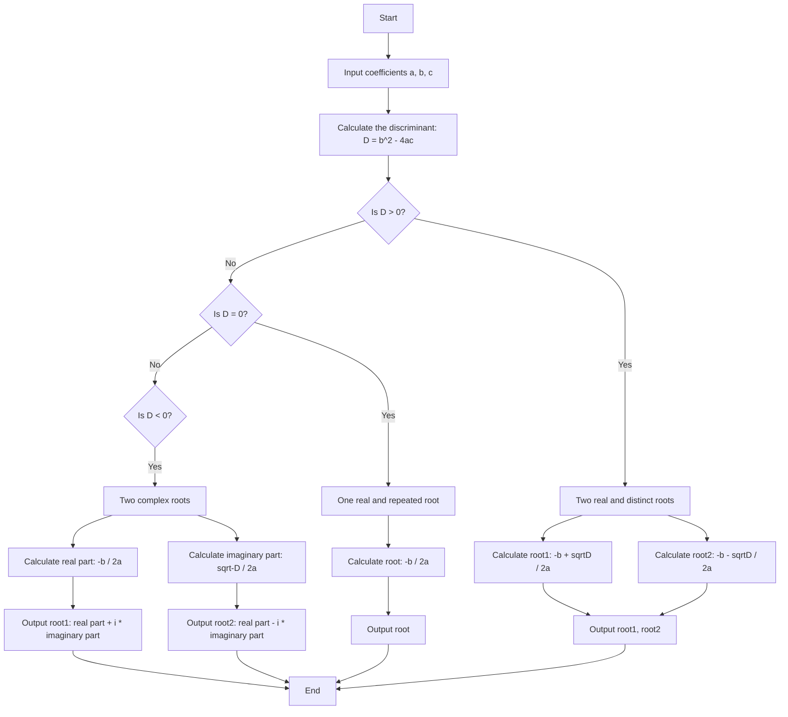

```mermaid
flowchart TD
    A[Start] --> B[Input coefficients a, b, c]
    B --> C[Calculate the discriminant: D = b^2 - 4ac]
    C --> D{Is D > 0?}
    D -- Yes --> E[Two real and distinct roots]
    E --> F[Calculate root1: -b + sqrtD / 2a]
    E --> G[Calculate root2: -b - sqrtD / 2a]
    F --> H[Output root1, root2]
    G --> H
    D -- No --> I{Is D = 0?}
    I -- Yes --> J[One real and repeated root]
    J --> K[Calculate root: -b / 2a]
    K --> L[Output root]
    I -- No --> M{Is D < 0?}
    M -- Yes --> N[Two complex roots]
    N --> O[Calculate real part: -b / 2a]
    N --> P[Calculate imaginary part: sqrt-D / 2a]
    O --> Q[Output root1: real part + i * imaginary part]
    P --> R[Output root2: real part - i * imaginary part]
    Q --> S[End]
    R --> S
    L --> S
    H --> S
```