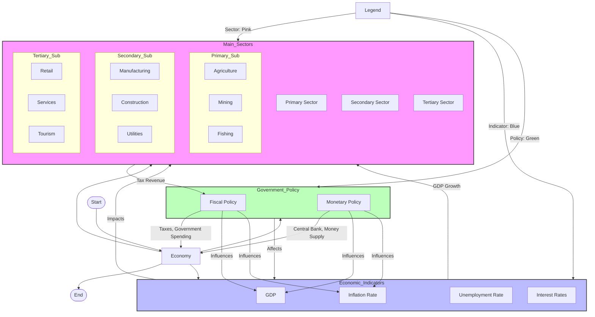

```mermaid
flowchart TD
    Start([Start])
    Economy[Economy]
    End([End])

    Start --> Economy

    subgraph Main_Sectors
        direction TB
        Primary[Primary Sector]
        Secondary[Secondary Sector]
        Tertiary[Tertiary Sector]

        subgraph Primary_Sub
            direction LR
            Agriculture[Agriculture]
            Mining[Mining]
            Fishing[Fishing]
        end

        subgraph Secondary_Sub
            direction LR
            Manufacturing[Manufacturing]
            Construction[Construction]
            Utilities[Utilities]
        end

        subgraph Tertiary_Sub
            direction LR
            Retail[Retail]
            Services[Services]
            Tourism[Tourism]
        end
    end

    subgraph Economic_Indicators
        direction TB
        GDP[GDP]
        Inflation[Inflation Rate]
        Unemployment[Unemployment Rate]
        Interest[Interest Rates]
    end

    subgraph Government_Policy
        direction TB
        Fiscal[Fiscal Policy]
        Monetary[Monetary Policy]
    end

    Economy --> Main_Sectors
    Economy --> Economic_Indicators
    Economy --> Government_Policy

    Main_Sectors -->|Tax Revenue| Fiscal
    Government_Policy -->|Affects| Economic_Indicators
    Economic_Indicators -->|Impacts| Main_Sectors

    Fiscal -->|Taxes, Government Spending| Economy
    Monetary -->|Central Bank, Money Supply| Economy

    Economic_Indicators -->|GDP Growth| Main_Sectors

    Fiscal -->|Influences| GDP
    Fiscal -->|Influences| Inflation
    Monetary -->|Influences| GDP
    Monetary -->|Influences| Inflation

    Economy --> End

    classDef sector fill:#f9f,stroke:#333,stroke-width:2px;
    classDef indicator fill:#bbf,stroke:#333,stroke-width:2px;
    classDef policy fill:#bfb,stroke:#333,stroke-width:2px;

    class Main_Sectors sector
    class Economic_Indicators indicator
    class Government_Policy policy

    Legend[Legend]
    Legend -->|Sector: Pink| Main_Sectors
    Legend -->|Indicator: Blue| Economic_Indicators
    Legend -->|Policy: Green| Government_Policy
```