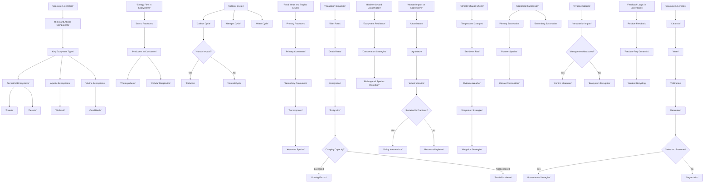

```mermaid
flowchart TD
    A['Ecosystem Definition'] --> B['Biotic and Abiotic Components']
    B --> C['Key Ecosystem Types']
    C --> C1['Terrestrial Ecosystems']
    C --> C2['Aquatic Ecosystems']
    C --> C3['Marine Ecosystems']
    C1 --> C1a['Forests']
    C1 --> C1b['Deserts']
    C2 --> C2a['Wetlands']
    C3 --> C3a['Coral Reefs']
    
    D['Energy Flow in Ecosystems'] --> E['Sun to Producers']
    E --> F['Producers to Consumers']
    F --> G['Photosynthesis']
    F --> H['Cellular Respiration']
    
    I['Nutrient Cycles'] --> J['Carbon Cycle']
    I --> K['Nitrogen Cycle']
    I --> L['Water Cycle']
    J --> M{'Human Impact?'}
    M -->|Yes| N['Pollution']
    M -->|No| O['Natural Cycle']
    
    P['Food Webs and Trophic Levels'] --> Q['Primary Producers']
    Q --> R['Primary Consumers']
    R --> S['Secondary Consumers']
    S --> T['Decomposers']
    T --> U['Keystone Species']
    
    V['Population Dynamics'] --> W['Birth Rates']
    W --> X['Death Rates']
    X --> Y['Immigration']
    Y --> Z['Emigration']
    Z --> AA{'Carrying Capacity?'}
    AA -->|Exceeded| AB['Limiting Factors']
    AA -->|Not Exceeded| AC['Stable Population']
    
    AD['Biodiversity and Conservation'] --> AE['Ecosystem Resilience']
    AE --> AF['Conservation Strategies']
    AF --> AG['Endangered Species Protection']
    
    AH['Human Impact on Ecosystems'] --> AI['Urbanization']
    AI --> AJ['Agriculture']
    AJ --> AK['Industrialization']
    AK --> AL{'Sustainable Practices?'}
    AL -->|Yes| AM['Policy Interventions']
    AL -->|No| AN['Resource Depletion']
    
    AO['Climate Change Effects'] --> AP['Temperature Changes']
    AP --> AQ['Sea-Level Rise']
    AQ --> AR['Extreme Weather']
    AR --> AS['Adaptation Strategies']
    AS --> AT['Mitigation Strategies']
    
    AU['Ecological Succession'] --> AV['Primary Succession']
    AV --> AW['Pioneer Species']
    AW --> AX['Climax Communities']
    AU --> AY['Secondary Succession']
    
    AZ['Invasive Species'] --> BA['Introduction Impact']
    BA --> BB{'Management Measures?'}
    BB -->|Yes| BC['Control Measures']
    BB -->|No| BD['Ecosystem Disruption']
    
    BE['Feedback Loops in Ecosystems'] --> BF['Positive Feedback']
    BF --> BG['Predator-Prey Dynamics']
    BG --> BH['Nutrient Recycling']
    
    BI['Ecosystem Services'] --> BJ['Clean Air']
    BJ --> BK['Water']
    BK --> BL['Pollination']
    BL --> BM['Recreation']
    BM --> BN{'Value and Preserve?'}
    BN -->|Yes| BO['Preservation Strategies']
    BN -->|No| BP['Degradation']
```