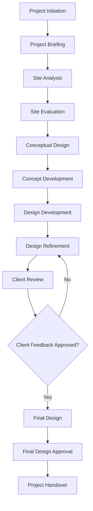

```mermaid
flowchart TD
    A[Project Initiation] --> B[Project Briefing]
    B --> C[Site Analysis]
    C --> D[Site Evaluation]
    D --> E[Conceptual Design]
    E --> F[Concept Development]
    F --> G[Design Development]
    G --> H[Design Refinement]
    H --> I[Client Review]
    I --> J{Client Feedback Approved?}
    J -->|Yes| K[Final Design]
    J -->|No| H
    K --> L[Final Design Approval]
    L --> M[Project Handover]
```