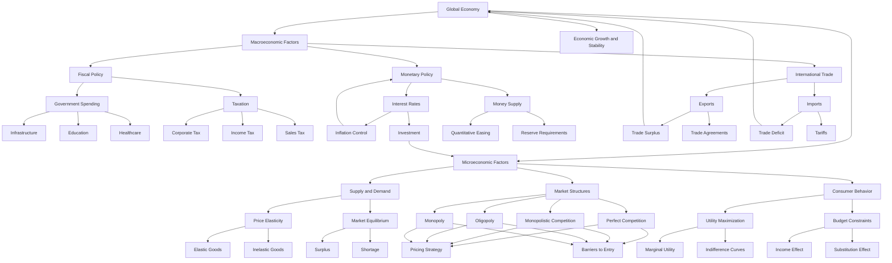

```mermaid
flowchart TD
    A[Global Economy] --> B[Macroeconomic Factors]
    A --> C[Microeconomic Factors]
    
    B --> D[Fiscal Policy]
    B --> E[Monetary Policy]
    B --> F[International Trade]
    
    D --> G[Government Spending]
    D --> H[Taxation]
    G --> I[Infrastructure]
    G --> J[Education]
    G --> K[Healthcare]
    H --> L[Corporate Tax]
    H --> M[Income Tax]
    H --> N[Sales Tax]
    
    E --> O[Interest Rates]
    E --> P[Money Supply]
    O --> Q[Inflation Control]
    O --> R[Investment]
    P --> S[Quantitative Easing]
    P --> T[Reserve Requirements]
    
    F --> U[Exports]
    F --> V[Imports]
    U --> W[Trade Surplus]
    U --> X[Trade Agreements]
    V --> Y[Trade Deficit]
    V --> Z[Tariffs]
    
    C --> AA[Supply and Demand]
    C --> AB[Market Structures]
    C --> AC[Consumer Behavior]
    
    AA --> AD[Price Elasticity]
    AA --> AE[Market Equilibrium]
    AD --> AF[Elastic Goods]
    AD --> AG[Inelastic Goods]
    AE --> AH[Surplus]
    AE --> AI[Shortage]
    
    AB --> AJ[Perfect Competition]
    AB --> AK[Monopolistic Competition]
    AB --> AL[Oligopoly]
    AB --> AM[Monopoly]
    AJ --> AN[Pricing Strategy]
    AJ --> AO[Barriers to Entry]
    AK --> AN
    AK --> AO
    AL --> AN
    AL --> AO
    AM --> AN
    AM --> AO
    
    AC --> AP[Utility Maximization]
    AC --> AQ[Budget Constraints]
    AP --> AR[Marginal Utility]
    AP --> AS[Indifference Curves]
    AQ --> AT[Income Effect]
    AQ --> AU[Substitution Effect]
    
    Q --> E
    W --> A
    Y --> A
    R --> C
    
    A --> AV[Economic Growth and Stability]
```