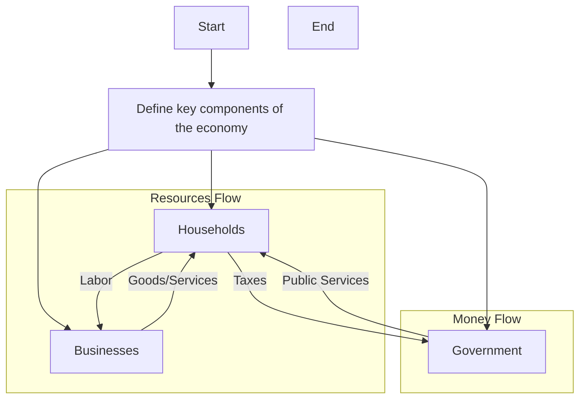

```mermaid
flowchart TD
    A[Start] --> B[Define key components of the economy]
    B --> C[Households]
    B --> D[Businesses]
    B --> E[Government]
    
    subgraph Resources Flow
        C -->|Labor| D
        D -->|Goods/Services| C
    end
    
    subgraph Money Flow
        C -->|Taxes| E
        E -->|Public Services| C
    end
    
    F[End]
```