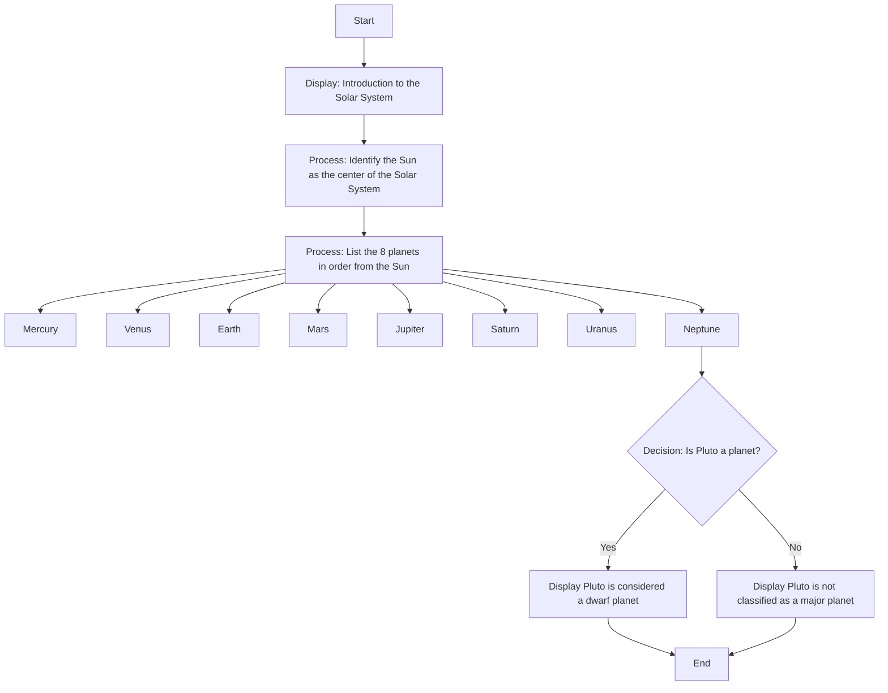

```mermaid
flowchart TD
    A[Start] --> B[Display: Introduction to the Solar System]
    B --> C[Process: Identify the Sun as the center of the Solar System]
    C --> D[Process: List the 8 planets in order from the Sun]
    D --> D1[Mercury]
    D --> D2[Venus]
    D --> D3[Earth]
    D --> D4[Mars]
    D --> D5[Jupiter]
    D --> D6[Saturn]
    D --> D7[Uranus]
    D --> D8[Neptune]
    D8 --> E{Decision: Is Pluto a planet?}
    E --> |Yes| F[Display Pluto is considered a dwarf planet]
    E --> |No| G[Display Pluto is not classified as a major planet]
    F --> H[End]
    G --> H[End]
```