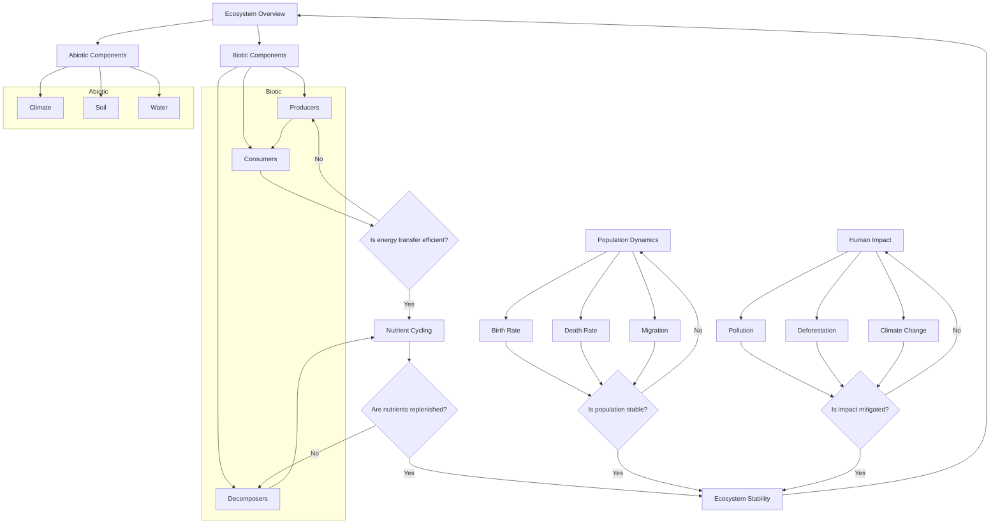

```mermaid
flowchart TD
    A[Ecosystem Overview] --> B[Biotic Components]
    A --> C[Abiotic Components]
    
    subgraph Biotic
        B1[Producers]
        B2[Consumers]
        B3[Decomposers]
    end
    
    subgraph Abiotic
        C1[Climate]
        C2[Soil]
        C3[Water]
    end
    
    B --> B1
    B --> B2
    B --> B3
    
    C --> C1
    C --> C2
    C --> C3
    
    B1 --> B2
    B2 --> D{Is energy transfer efficient?}
    D -->|Yes| E[Nutrient Cycling]
    D -->|No| B1
    
    B3 --> E
    E --> F{Are nutrients replenished?}
    F -->|Yes| G[Ecosystem Stability]
    F -->|No| B3
    
    H[Population Dynamics] --> H1[Birth Rate]
    H --> H2[Death Rate]
    H --> H3[Migration]
    H1 --> I{Is population stable?}
    H2 --> I
    H3 --> I
    I -->|Yes| G
    I -->|No| H
    
    J[Human Impact] --> J1[Pollution]
    J --> J2[Deforestation]
    J --> J3[Climate Change]
    J1 --> K{Is impact mitigated?}
    J2 --> K
    J3 --> K
    K -->|Yes| G
    K -->|No| J
    
    G --> A
```