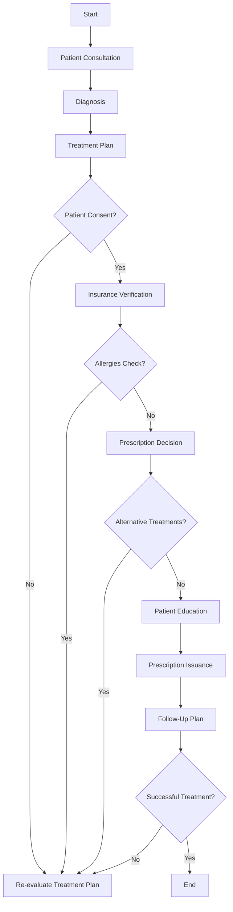

```mermaid
flowchart TD
    A[Start] --> B[Patient Consultation]
    B --> C[Diagnosis]
    C --> D[Treatment Plan]
    D --> E{Patient Consent?}
    E -- Yes --> F[Insurance Verification]
    E -- No --> J[Re-evaluate Treatment Plan]
    F --> G{Allergies Check?}
    G -- Yes --> J[Re-evaluate Treatment Plan]
    G -- No --> H[Prescription Decision]
    H --> I{Alternative Treatments?}
    I -- Yes --> J[Re-evaluate Treatment Plan]
    I -- No --> K[Patient Education]
    K --> L[Prescription Issuance]
    L --> M[Follow-Up Plan]
    M --> N{Successful Treatment?}
    N -- Yes --> O[End]
    N -- No --> J[Re-evaluate Treatment Plan]
```