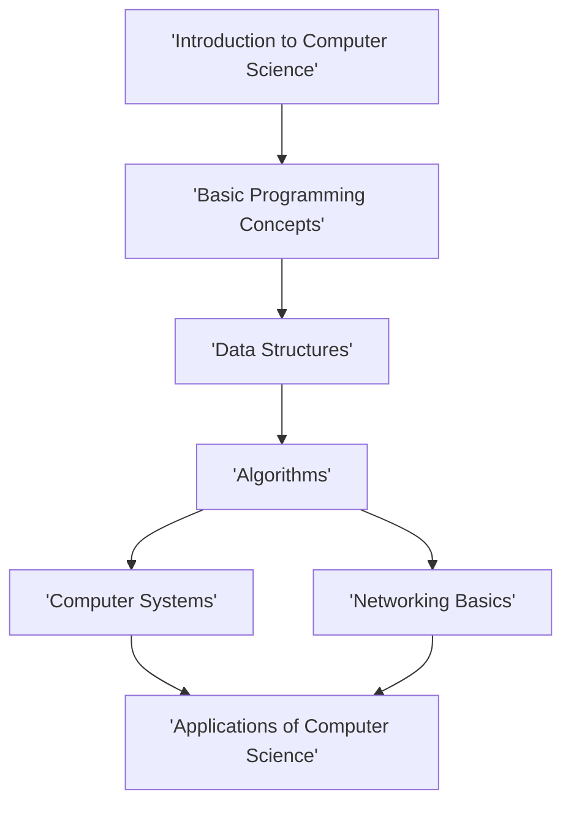

```mermaid
flowchart TD
    A['Introduction to Computer Science'] --> B['Basic Programming Concepts']
    B --> C['Data Structures']
    C --> D['Algorithms']
    D --> E['Computer Systems']
    D --> F['Networking Basics']
    E --> G['Applications of Computer Science']
    F --> G
```