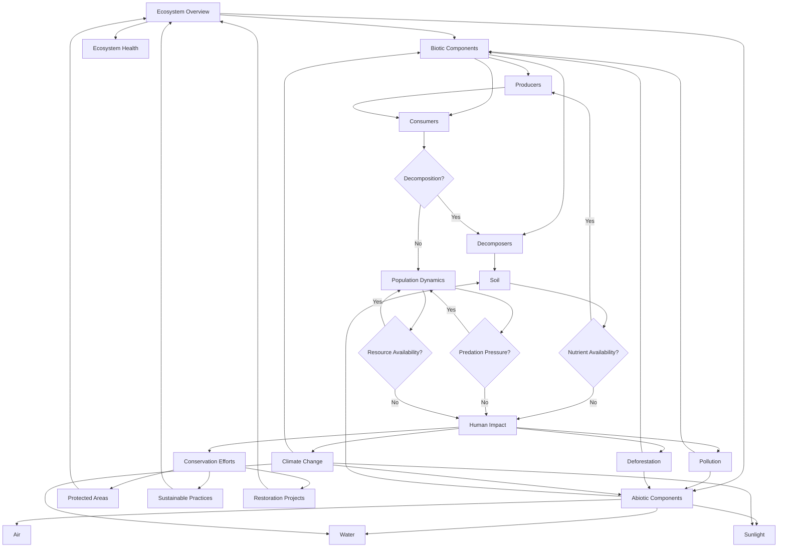

```mermaid
flowchart TD
    A[Ecosystem Overview]
    A --> B[Biotic Components]
    A --> C[Abiotic Components]
    
    B --> B1[Producers]
    B --> B2[Consumers]
    B --> B3[Decomposers]
    
    C --> C1[Water]
    C --> C2[Air]
    C --> C3[Soil]
    C --> C4[Sunlight]
    
    B1 --> B2
    B2 --> D{Decomposition?}
    D -->|Yes| B3
    D -->|No| E[Population Dynamics]
    
    B3 --> C3
    C3 --> F{Nutrient Availability?}
    F -->|Yes| B1
    F -->|No| G[Human Impact]
    
    E --> H{Predation Pressure?}
    E --> I{Resource Availability?}
    H -->|Yes| E
    H -->|No| G
    I -->|Yes| E
    I -->|No| G
    
    G --> G1[Pollution]
    G --> G2[Deforestation]
    G --> G3[Climate Change]
    
    G1 --> C
    G2 --> C
    G3 --> C
    G1 --> B
    G2 --> B
    G3 --> B
    
    J[Conservation Efforts] --> J1[Protected Areas]
    J --> J2[Sustainable Practices]
    J --> J3[Restoration Projects]
    
    J1 --> A
    J2 --> A
    J3 --> A
    
    G3 --> C4
    G3 --> C1
    
    K[Ecosystem Health]
    A --> K
    G --> J
```