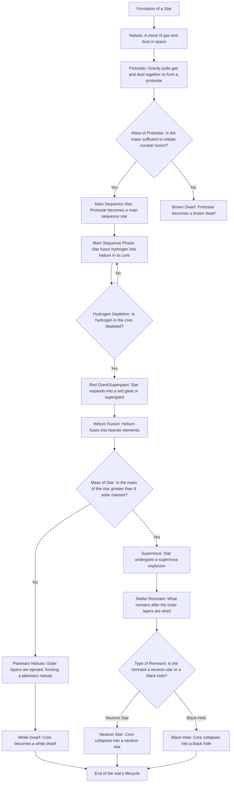

```mermaid
flowchart TD
    Start["Formation of a Star"]
    Nebula["Nebula: A cloud of gas and dust in space"]
    Protostar["Protostar: Gravity pulls gas and dust together to form a protostar"]
    MassProtostar{"Mass of Protostar: Is the mass sufficient to initiate nuclear fusion?"}
    MainSequenceStar["Main Sequence Star: Protostar becomes a main sequence star"]
    BrownDwarf["Brown Dwarf: Protostar becomes a brown dwarf"]
    MainSequencePhase["Main Sequence Phase: Star fuses hydrogen into helium in its core"]
    HydrogenDepletion{"Hydrogen Depletion: Is hydrogen in the core depleted?"}
    RedGiantSupergiant["Red Giant/Supergiant: Star expands into a red giant or supergiant"]
    HeliumFusion["Helium Fusion: Helium fuses into heavier elements"]
    MassStar{"Mass of Star: Is the mass of the star greater than 8 solar masses?"}
    Supernova["Supernova: Star undergoes a supernova explosion"]
    PlanetaryNebula["Planetary Nebula: Outer layers are ejected, forming a planetary nebula"]
    StellarRemnant["Stellar Remnant: What remains after the outer layers are shed"]
    TypeRemnant{"Type of Remnant: Is the remnant a neutron star or a black hole?"}
    NeutronStar["Neutron Star: Core collapses into a neutron star"]
    BlackHole["Black Hole: Core collapses into a black hole"]
    WhiteDwarf["White Dwarf: Core becomes a white dwarf"]
    End["End of the star's lifecycle"]

    Start --> Nebula
    Nebula --> Protostar
    Protostar --> MassProtostar
    MassProtostar -->|Yes| MainSequenceStar
    MassProtostar -->|No| BrownDwarf
    MainSequenceStar --> MainSequencePhase
    MainSequencePhase --> HydrogenDepletion
    HydrogenDepletion -->|Yes| RedGiantSupergiant
    HydrogenDepletion -->|No| MainSequencePhase
    RedGiantSupergiant --> HeliumFusion
    HeliumFusion --> MassStar
    MassStar -->|Yes| Supernova
    MassStar -->|No| PlanetaryNebula
    Supernova --> StellarRemnant
    PlanetaryNebula --> WhiteDwarf
    StellarRemnant --> TypeRemnant
    TypeRemnant -->|Neutron Star| NeutronStar
    TypeRemnant -->|Black Hole| BlackHole
    WhiteDwarf --> End
    NeutronStar --> End
    BlackHole --> End
```